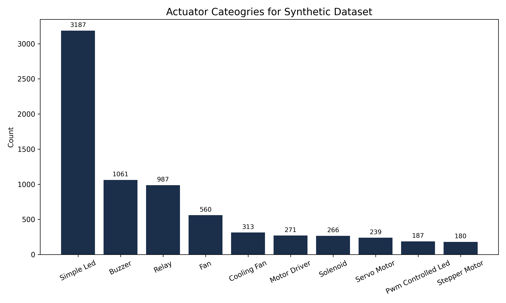
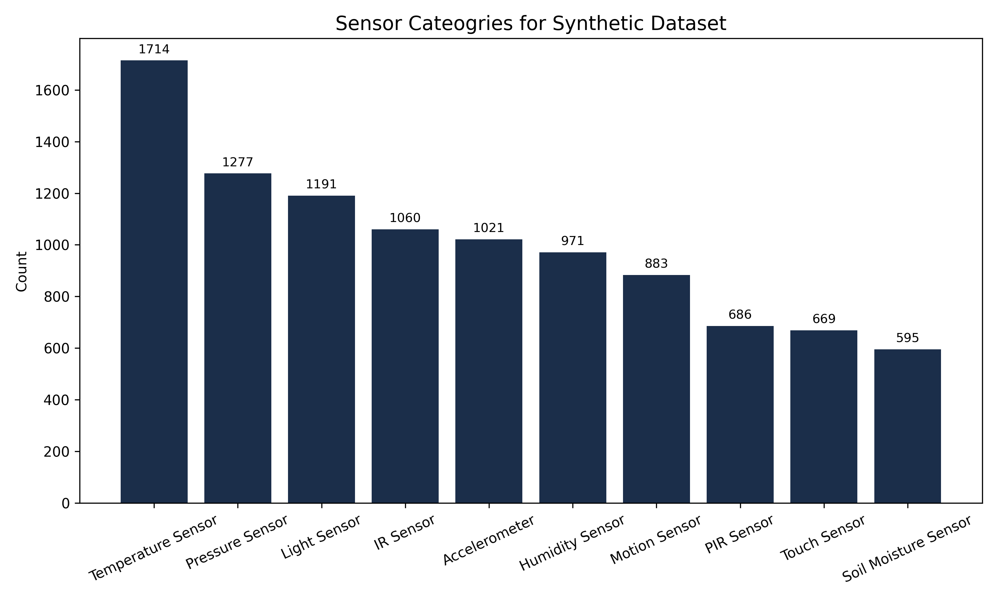
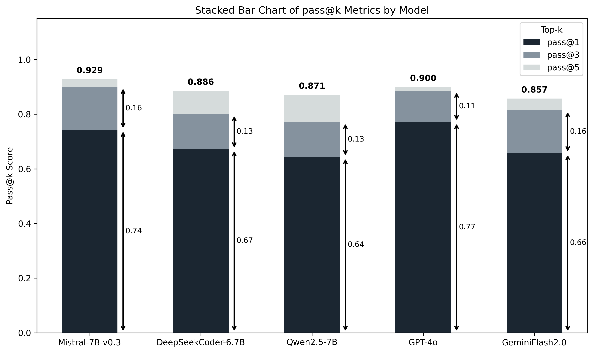
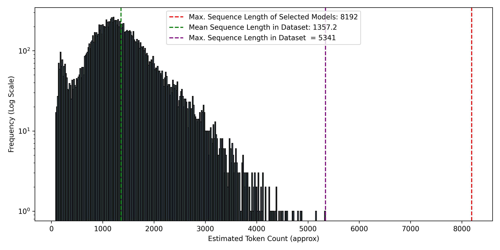
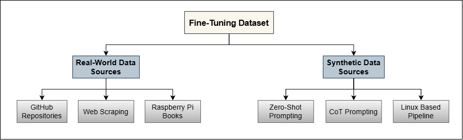
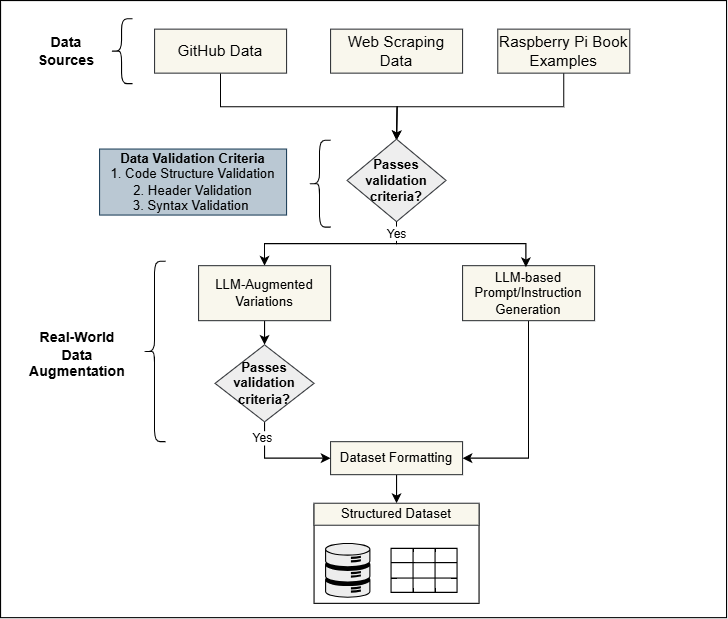
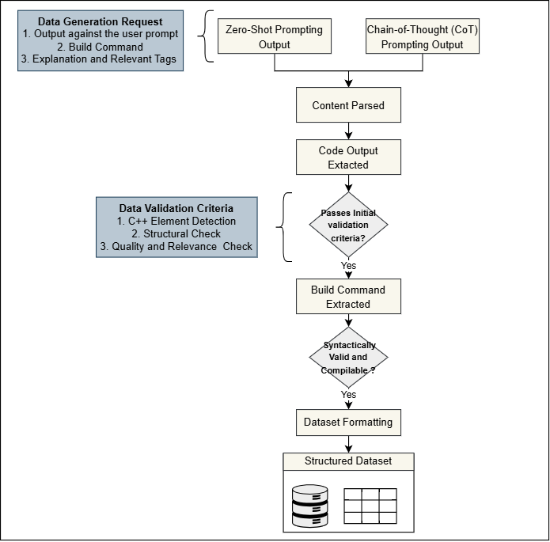

# HW/SW Interface LLM Dataset <a href="https://huggingface.co/datasets/NOKHAB-Lab/LLM_4_HW-SW_Interface"></a>

> Replication package for the paper:
> **"Domain-Specific Fine-Tuning of Large Language Models for HW/SW Interface Generation: An Empirical Study"**
> *Accepted at CAiSE 2026 — Verona, Italy, June 8–12, 2026*

> **To reproduce the paper results, see [REPLICATION.md](REPLICATION.md).**

---

## Overview

Modern information systems increasingly extend into cyber-physical and IoT environments, where generating correct hardware-software (HW/SW) interface code is a critical bottleneck. General-purpose large language models (LLMs) frequently fail on embedded systems tasks — producing non-compilable code, hallucinating API calls, and misusing peripheral libraries — due to the scarcity of hardware-specific training data.

This repository provides the complete replication package for our study, including:

- A **hybrid dataset of ~16,000 compiler-validated C programs** for ARM-based embedded platforms (Raspberry Pi 3B+, Zero W, 4B, 5)
- A **synthetic data generation pipeline** with compiler-in-the-loop validation
- A **real-world data collection pipeline** with collected raw `.c` source files
- **QLoRA fine-tuning notebooks** for all five evaluated open-source models
- A **multi-stage evaluation pipeline** and all raw evaluation results
- **Analysis scripts**, contamination/leakage checks, and all figures

Fine-tuned open-source models (6–7B parameters) trained on this dataset achieve **81–90% accuracy**, matching or exceeding GPT-4o (89.3%) and Gemini Flash 2.0 (87.2%) on HW/SW interface generation tasks, with Mistral-7B reaching **Pass@5 = 0.929**, outperforming all commercial baselines.

---

## Dataset at a Glance

| Split | Source | Size |
|---|---|---|
| Training | Synthetic (compiler-validated, leakage-removed) | ~16K examples (15,886) |
| Training | Real-world (GitHub + educational, leakage-removed) | ~1K examples (1,053) |
| Training | Combined JSONL (fine-tuning ready) | ~16K examples (15,886) |
| Test | Curated representative prompts | 70 prompts |

The dataset covers **six embedded task categories** across diverse sensor/actuator types, communication protocols (SPI, I²C, UART, 1-Wire), and Raspberry Pi hardware models.

### Dataset Composition

| Category | Count | % |
|---|---|---|
| Sensor integration | 8,559 | 53.8% |
| Combined sensor-actuator | 5,582 | 35.1% |
| Actuator control | 1,009 | 6.3% |
| Other | 749 | 4.7% |

The dataset covers **over 400 distinct sensor types** — pressure, temperature, humidity, gas, IMU, ultrasonic, and optical sensors from multiple manufacturers — and a wide range of actuators including servo motors, relays, stepper motors, and PWM devices.

---

## Results

### Pre-trained vs. Fine-tuned Accuracy

<p align="center">
  
</p>

| Model | Pre-trained | Fine-tuned | Relative Gain |
|---|---|---|---|
| CodeLLaMA-7B-HF | 48.5% | 80.9% | +65% |
| Mistral-7B-Instruct-v0.3 | 72.5% | 89.3% | +23% |
| StarCoder2-7B | 54.4% | 86.6% | +59% |
| DeepSeek-Coder-6.7B-Instruct | 79.0% | **90.05%** | +14% |
| Qwen2.5-7B-Instruct | 77.7% | 87.7% | +13% |

### Fine-tuned Models vs. Commercial SOTA

<p align="center">
  
</p>

Fine-tuned open-source models match and in some cases exceed commercial state-of-the-art systems (GPT-4o: 89.29%, Gemini Flash 2.0: 87.22%).

### Pass@k Evaluation

<p align="center">
  
</p>

| Model | Pass@1 | Pass@3 | Pass@5 |
|---|---|---|---|
| Mistral-7B-Instruct-v0.3 | 0.757 | 0.871 | **0.929** |
| GPT-4o | 0.771 | 0.857 | 0.900 |
| DeepSeek-Coder-6.7B-Instruct | 0.743 | 0.829 | 0.886 |
| Qwen2.5-7B-Instruct | 0.729 | 0.814 | 0.871 |
| Gemini Flash 2.0 | 0.686 | 0.786 | 0.857 |

---

## Repository Structure

```
HW-SW-Interface-LLM-Dataset/
├── README.md
│
├── dataset/                         # Training and test data
│   ├── training/
│   │   ├── synthetic/               # ~16K compiler-validated synthetic programs (15,886)
│   │   ├── real-world/              # ~1K real-world programs (1,053)
│   │   └── training_set.jsonl  # Fine-tuning ready JSONL
│   └── test/                        # 70-prompt test set, template (prompts only), and statistics
│
├── pipelines/                       # Data generation pipelines
│   ├── 1-synthetic-data-pipeline/   # Automated synthetic data generation
│   ├── 2-real-world-data-pipeline/  # Real-world code collection
│   └── 3-repair-pipeline/           # Iterative code repair
│
├── fine-tuning/                     # QLoRA fine-tuning notebooks
│   ├── codellama-7b/
│   ├── mistral-7b/
│   ├── starcoder2-7b/
│   ├── deepseek-coder-6.7b/
│   └── qwen2.5-7b/
│
├── evaluation/                      # Post-fine-tuning evaluation
│   ├── validation-pipeline/         # 4-criterion scoring pipeline
│   └── results/                     # Raw results (CSV, JSON, plots) for all eval criteria
│       ├── eval1-base-vs-finetuned/
│       ├── eval2-prompt-variation/
│       ├── eval3-pass-at-k/
│       ├── eval4-hardware/
│       └── eval5-large-pass-at-k/
│
├── analysis/                        # Dataset analysis and result visualization
│   ├── training/                    # Training dataset analysis scripts
│   ├── test/                        # Test set statistics
│   ├── accuracy_stats.py             # Accuracy summary from evaluation JSONs
│   ├── time_stats.py                 # Execution time statistics
│   ├── extract_errors.py            # Build/syntax error extraction
│   └── plot_generation.ipynb        # Generate all paper figures
│
└── figures/                         # All paper figures (Fig4a, Fig4b, Fig5–Fig14)
```

---

## Workflow

```
1. dataset/                   Build training data using pipelines/
   └── pipelines/

2. fine-tuning/               QLoRA fine-tune each model on training_set.jsonl
   └── <model>/training/

3. evaluation/                Score model outputs → CSV + JSON results
   ├── validation-pipeline/
   └── results/

4. analysis/                  Compute statistics, generate plots
   └── plot_generation.ipynb
```

---

## Evaluation Framework

Each generated code sample is scored across four weighted dimensions:

| Dimension | Weight | Criteria |
|---|---|---|
| Structural Validation | **40%** | `main()` presence (10%), required libraries (10%), no restricted headers (10%), no C++ elements (5%), include directives (5%) |
| Compilation Success | **25%** | Valid syntax (10%), successful GCC build (15%) |
| Functional Relevance | **25%** | Task relevance via Gemini Flash 2.0 (10%) + GPT-4o (10%), reference relevance via both (2.5% each) |
| Code Quality | **10%** | Static analysis rating 1–5 via `cppcheck` (5%), compiler warnings count (5%) |

Full implementation: `evaluation/validation-pipeline/`.

---

## Pipeline Overview

### 1. Synthetic Data Pipeline (`pipelines/1-synthetic-data-pipeline/`)

Three-stage automated pipeline:
1. **Base Prompt Generation** — specifies functional requirements per sensor/actuator category, target board, and application context
2. **Prompt Enrichment** — injects library constraints, error handling requirements, and OS compatibility rules
3. **Code Synthesis + Compiler-in-the-Loop Validation** — generates programs via Gemini Flash 2.0, validates through four stages: C++ filtering → structural check → library validation → GCC compilation (up to 3 retries via repair pipeline)

**Run:**
```bash
cd pipelines/1-synthetic-data-pipeline
python task_generator/task_manager.py
```

### 2. Real-World Data Pipeline (`pipelines/2-real-world-data-pipeline/`)

Collects and validates publicly available embedded C programs from:
- GitHub repositories via REST API v3
- Educational resources (tutorials, programming books) via Google SerpAPI and manual curation

Applies the same four-stage validation stack. Task descriptions generated via Gemini Flash 2.0.

### 3. Fine-Tuning (`fine-tuning/`)

All models were fine-tuned using **QLoRA** (4-bit NF4 quantization + BF16 compute) on dual **NVIDIA H100 80GB GPUs** via [SDU uCloud](https://cloud.sdu.dk/).

| Model | LoRA Config | LR | Epochs | Optimizer |
|---|---|---|---|---|
| CodeLLaMA-7B-HF | r=16, α=32 | 2e-4 | 3 | adamw_torch, cosine |
| Mistral-7B-Instruct-v0.3 | r=16, α=32 | 2e-5 | 3 | paged_adamw_32bit, cosine |
| StarCoder2-7B | r=16, α=32 | 2e-4 | 3 | adamw_torch, cosine |
| DeepSeek-Coder-6.7B-Instruct | r=16, α=32 | 2e-5 | 3 | paged_adamw_32bit, linear |
| Qwen2.5-7B-Instruct | r=16, α=32 | 1e-4 | 3 | paged_adamw_32bit, cosine |

- **Framework**: HuggingFace `SFTTrainer` (TRL) with PEFT
- **Sequence length**: 6,000 tokens
- **Batch size**: 2 per device, gradient accumulation 4 steps
- **Validation split**: 10% held out; early stopping on validation loss

### 4. Evaluation (`evaluation/`)

Full evaluation pipeline with three protocols:

| Script | Protocol |
|---|---|
| `execute_validation_criteria1.py` | **Eval 1**: Base vs. fine-tuned — 70 prompts |
| `execute_validation_criteria2.py` | **Eval 2**: Prompt variation robustness |
| `execute_validation_criteria3.py` | **Eval 3**: Pass@k (k ∈ {1, 3, 5}, temperature=0.7) |
| `execute_validation_GPT_and_Gemini.py` | Functional relevance scoring via GPT-4o + Gemini |

---

## Requirements

### System
- Linux (Ubuntu 20.04+ recommended)
- GCC toolchain + embedded libraries: `wiringPi`, `pigpio`, `bcm2835`
- Python 3.10+
- CUDA-capable GPU (for fine-tuning; tested on dual NVIDIA H100 80GB)

### Python Packages
```bash
bash pipelines/1-synthetic-data-pipeline/install_all_deps.sh
```

Key packages: `transformers`, `trl`, `peft`, `bitsandbytes`, `accelerate`, `torch`, `google-generativeai`, `openai`

### API Keys

Set in the relevant `config/model.py` files:
- `GEMINI_API_KEY` — for synthetic data generation and functional relevance evaluation
- `OPENAI_API_KEY` — for GPT-4o functional relevance evaluation

---

## Dataset Format

Each entry in the training dataset (JSON/JSONL) follows this structure:

```json
{
  "category":     "Sensor Integration",
  "input":        "Write C code for Raspberry Pi 4B to read a DHT22 temperature and humidity sensor using wiringPi and log readings every 2 seconds.",
  "output":       "#include <wiringPi.h>\n#include <stdio.h>\n...",
  "explanation":  "Reads temperature and humidity from DHT22 via GPIO pin 7, logs to stdout every 2s with error handling.",
  "tags":         "Raspberry Pi, C, GPIO, DHT22, wiringPi, sensor, humidity",
  "file-name":    "dht22_reader.c",
  "build-command":"gcc -o dht22_reader dht22_reader.c -lwiringPi"
}
```


## Token Length Distribution

<p align="center">
  
</p>

Mean sequence length ~1,357 tokens; max ~5,341 — all well within the 8,192-token context window of the evaluated models.

---

## Methodology Figures

### Dataset Sources

The training dataset combines two complementary sources — real-world C programs collected from GitHub and educational resources, and synthetic programs generated via Gemini Flash 2.0 with compiler-in-the-loop validation.

<p align="center">
  
</p>
<p align="center"><em>Overview of fine-tuning dataset sources (real-world + synthetic)</em></p>

---

### Real-World Data Collection & Processing Pipeline

The real-world pipeline collects `.c` source files from GitHub repositories and educational materials, then processes them through a multi-stage validation stack before augmenting with LLM-generated task descriptions and prompt variations.

<p align="center">
  
</p>
<p align="center"><em>Real-world data collection & processing pipeline</em></p>

---

### Synthetic Data Collection & Processing Pipeline

The synthetic pipeline uses structured prompting (zero-shot and chain-of-thought) to generate C programs via Gemini Flash 2.0, then validates each program through four sequential stages — C++ detection, structural check, header inspection, and GCC compilation — before formatting into the training dataset.

<p align="center">
  
</p>
<p align="center"><em>Synthetic data collection & processing pipeline</em></p>

---

## License

This dataset and associated code are released under the [Creative Commons Attribution 4.0 International (CC BY 4.0)](LICENSE) license. You are free to share and adapt the material for any purpose, provided appropriate credit is given.

Please cite the paper if you use any part of this replication package (see [Citation](#citation) above).

